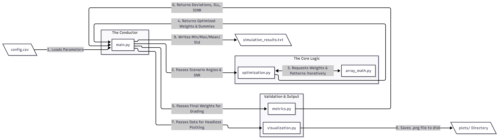

# Advanced RF Aspects of UAVs - Beamforming Simulation

**Author:** Andreas Manitsas  
**Course:** UAV15 Advanced RF Aspects of UAVs (MSc Aerial Autonomous Systems)  
**Institution:** Aristotle University of Thessaloniki - Department of Electrical & Computer Engineering

This repository contains a Python-based simulation of two advanced antenna array algorithms: the **Null Steering Beamformer (NSB)** and the **Minimum Variance Distortionless Response (MVDR) Beamformer**. 

The software simulates a 24-element uniform linear antenna array. Depending on the selected algorithm, it calculates complex weights to steer the main lobe toward a desired signal while suppressing incoming interference signals (either through deterministic mathematical nulls or statistical spatial covariance). To meet strict Side Lobe Level (SLL) constraints ($\leq -20$ dB), it utilizes an iterative peak-nulling algorithm to strategically place artificial "dummy" interferers.

## Features
* **Multi-Algorithm Support:** Seamlessly toggle between deterministic (NSB) and statistical (MVDR) beamforming mathematical models.
* **Automated Batch Processing:** Sweeps through hundreds of required SNR and angular ($\delta$) permutations automatically.
* **Data-Driven Configuration:** Uses a central `config.csv` file to control algorithmic boundaries, beamformer selection, and SLL constraints without altering the core Python source code.
* **Headless Plot Generation:** Automatically creates a structured `plots/` directory and saves high-resolution charts without requiring a GUI or crashing the system's window manager.
* **Persistent Data Logging:** Writes all statistical outputs directly to a `simulation_results.txt` file for easy data extraction.

## File Architecture

To maintain a clean codebase, the project is modularized into distinct files:

* **`array_math.py`**: *The core RF physics engine.* Handles steering vectors, constraint matrices (NSB), spatial covariance matrices (MVDR), and computation of the complete 180° radiation pattern.
* **`metrics.py`**: *The validation and extraction layer.* Uses `scipy` to systematically find local peaks and nulls to calculate exact directional deviations ($\Delta\theta$) and the maximum Side Lobe Level (SLL).
* **`optimization.py`**: *The SLL control algorithm.* Implements an iterative, greedy approach that dynamically drops "dummy" interferers at the highest side lobes until the overall SLL floor falls below the target.
* **`visualization.py`**: *The plotting backend.* Generates high-resolution 2D plots of the normalized radiation pattern and safely saves them directly to disk.
* **`main.py`**: *The master execution loop.* Reads the configuration, generates the scenario matrix, runs the optimization algorithm, safely saves the `.png` plots, and outputs the final statistical metrics to a text file.
* **`config.csv`**: *The control panel.* A text file dictating the simulation's angular sweeps, SNR values, beamformer type, and algorithmic constraints.

## Configuration

The simulation parameters are completely decoupled from the core logic to allow rapid testing. 

### 1. The `config.csv` File
Edit the `config.csv` file in the root directory to adjust the simulation boundaries:
* `snr_values`: List of SNRs to test (e.g., `"-10, 0, 10, 20"`)
* `delta_values`: List of angular separations $\delta$ to test (e.g., `"6, 8, 10, 12, 14, 16"`)
* `base_start`: The starting angle for the scenario generation loop (Default: `30`)
* `max_angle`: The maximum angle limit for the loop (Default: `150`)
* `target_sll`: The desired maximum Side Lobe Level (Default: `-20.0`)
* `max_dummies`: The max number of artificial interferers the algorithm can place (Default: `18`)
* `beamformer_type`: Set to `nsb` or `mvdr` to switch the underlying RF math engine.

### 2. Plotting Toggle (`main.py`)
Inside `main.py`, you can toggle the visual image generation:
* `SAVE_PLOTS = True`: Generates and saves a `.png` file for every single angular scenario into dynamically created subfolders (e.g., `plots/MVDR/SNR_10/Delta_6/`). *Warning: Increases execution time and consumes disk space.*
* `SAVE_PLOTS = False`: Bypasses image generation entirely, running strictly the matrix math and statistical extraction for maximum speed.

## SW Flowchart



## Requirements

To run this simulation, you will need Python installed along with the following scientific libraries. Install them via your terminal:

```bash
pip install numpy scipy matplotlib
```

## How to Run the Simulation

```bash
python main.py
```